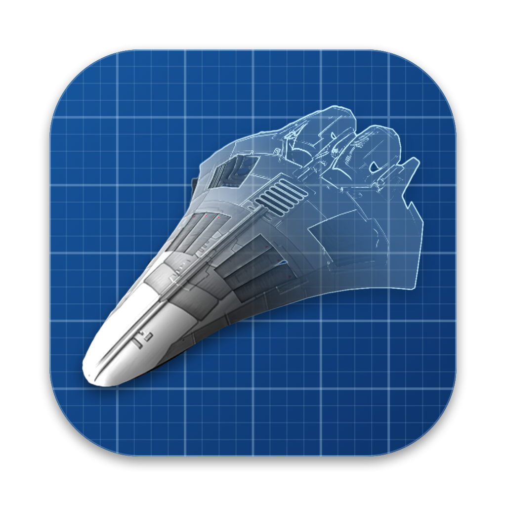

<p align="center">
  
</p>

<h1 align="center">Drydock</h1>

<p align="center">A pilot editor and game data browser for EV Nova on macOS</p>

Drydock is a native macOS pilot editor and game data browser for
[EV Nova](https://en.wikipedia.org/wiki/Escape_Velocity_Nova). It opens your
pilot save files, lets you edit them safely, and reads the game's `.rez`
data files so every ship, outfit, weapon, mission, and system is shown by
name instead of by ID number.

It also explains where you are in the game's storylines: which missions you
have done, which ones you can take next, and why a mission you expected
never showed up.

## Features

### Pilot editing

- **Pilot and ship**: nickname, gender, strict play, credits, combat rating,
  ship type and name, fuel, paint, last planet, and game date.
- **Outfits and weapons**: add, remove, and change counts and ammunition.
- **Escorts and fighters**: hired and captured escorts, carried fighters, and
  standing orders.
- **Current missions**: flags, rewards (including special pay codes),
  deadlines, and removal.
- **Story flags**: every flag the scenario uses, with a description of what
  sets it and what reads it.
- **Universe state**: explored systems and planets, characters, ranks,
  events, and prices.

### Storyline tools

- **Story chain flowcharts**: every mission chain drawn as a flowchart with
  per-mission status (active, available, completed, stuck, not reached yet,
  or impossible).
- **"Why can't I get this mission?"**: a checklist of what a mission needs
  (story flags, location, chance, combat rating, ship rules such as cargo
  space or fuel) and which of those your pilot is missing.
- **Lock diagnosis**: when a finished mission has shut off a storyline,
  Drydock names the mission holding the lock and lists the ways out that are
  actually possible in play.
- **One-click fixes**: mark a mission done or not done, or clear a lock by
  applying a real mission outcome, with a preview before anything changes.
- **Mission text**: offer, briefing, and completion text shown with your
  pilot's story choices applied.

### Galaxy map

- Every system at its in-game position with hyperspace links, planets, and
  governments.
- Search, pan, and zoom. Your pilot's current system is marked.
- **Find on Map** for any mission shows where it is offered, where it goes,
  where to return, and where its special ships are.

### Game data browser

- Browse every ship, outfit, weapon, and mission definition.
- Browse full mission chains, including success, failure, accept, refuse,
  and abort branches.

### Plug-in support

- Plug-ins in the `Nova Plug-ins` folder (including subfolders) load after
  the base game and override it the same way the game does.
- Story flag descriptions are built from the loaded data, so plug-in
  storylines are covered too.

## Safety

Pilot files are real save games, so Drydock is careful with them:

- Edits happen on an in-memory copy. Nothing is written until you press
  **Save Pilot Changes**.
- The first save in each session makes a timestamped backup next to the
  pilot file (for example `Chuck Yeager.plt.bak-20260927-164100`).
- If EV Nova saved the pilot while you were editing, Drydock warns you
  instead of silently overwriting the newer progress.
- Any part of the file Drydock doesn't understand is kept byte for byte.
- Fields whose location in the file is inferred but not yet confirmed in the
  game are marked in the editor, so you know to keep the backup until you've
  checked the result.

## Updates

When Drydock starts, it asks GitHub whether a newer release exists and, if
so, offers to open the download page. Nothing is downloaded or installed
automatically, and no information about you or your pilots is sent. You can
turn the launch check off in Settings, or check any time with **Drydock >
Check for Updates...**.

## Requirements

- macOS 14 (Sonoma) or newer
- Swift 5.10 or newer (Xcode 15.3+ or the Swift toolchain)
- An EV Nova install folder containing `Nova Files`, and optionally `Pilots`
  and `Nova Plug-ins`

## Building and running

```sh
swift run Drydock
```

On first launch Drydock asks for your EV Nova install folder. The pilots,
game data, and plug-in folders are found from there, and you can change the
folder later in Settings.

To build the full app bundle (a universal build for Apple silicon and Intel):

```sh
Tools/build-app.sh
```

The app is written to `dist/Drydock.app`. Add `--sign` to sign it with a
Developer ID certificate from your keychain, or `--notarize` to also package,
notarize, and staple a DMG. All the options are described at the top of the
script.

## Tests

```sh
swift test
```

The tests run against the real parsing and editing code, using a sample
pilot file in `Tests/DrydockTests/Fixtures`.

Some tests also check the decoders against real EV Nova game data. That data
can't be included in the repo, so those tests are skipped unless you point
them at your own install's `Nova Files` folder:

```sh
DRYDOCK_NOVA_FILES="/path/to/EV Nova/Nova Files" swift test
```

## Releasing

Releases are made with one command, from an up-to-date `main` with no
uncommitted changes:

```sh
Tools/release.sh
```

The next version is worked out from the latest release tag. By default the
last number goes up by one (`v0.1.0` becomes `v0.1.1`). For a bigger step:

```sh
Tools/release.sh minor    # 0.1.3 becomes 0.2.0
Tools/release.sh major    # 0.2.0 becomes 1.0.0
```

The script:

1. Checks that you're on `main`, have nothing uncommitted, and match GitHub
   exactly (nothing unpushed or unpulled).
2. Picks the next version.
3. Checks that this commit hasn't already been released.
4. Runs the tests.
5. Shows the version, the previous release, and the commit, and asks you to
   confirm.
6. Creates the tag (for example `v0.1.1`) and pushes it.

GitHub can't run the real-data tests, so set `DRYDOCK_NOVA_FILES` (see
[Tests](#tests)) to have the script run them before releasing. It's easiest
to export it in your shell profile. If it isn't set, the script warns you and
releases anyway.

Pushing the tag starts the Release workflow on GitHub. It builds the app,
signs it with the Developer ID certificate, notarizes it with Apple, and
publishes a GitHub release with the DMG attached and release notes generated
from the commits. This takes about 10 minutes. The script prints links to
follow its progress.

The version number comes from the tag, so nothing in the code needs changing
before a release.

### If a release fails

The tag stays on GitHub even if the workflow fails. Once the problem is fixed
and pushed, delete the failed tag and run the script again. It will pick the
same version number:

```sh
git push origin --delete v0.1.1
git tag -d v0.1.1
Tools/release.sh
```

### One-time setup

The Release workflow needs these repository secrets (**Settings > Secrets and
variables > Actions**):

| Secret | Value |
| --- | --- |
| `DEVELOPER_ID_P12_BASE64` | The Developer ID Application certificate and private key, exported as `.p12` and base64 encoded |
| `DEVELOPER_ID_P12_PASSWORD` | The password set when exporting the `.p12` |
| `NOTARY_KEY_P8_BASE64` | An App Store Connect API key (`.p8`, Developer role), base64 encoded |
| `NOTARY_KEY_ID` | That API key's Key ID |
| `NOTARY_ISSUER_ID` | The Issuer ID shown on the App Store Connect API keys page |

To base64 encode a file and copy it to the clipboard:
`base64 -i <file> | pbcopy`.

## Project layout

| Folder | Contents |
| --- | --- |
| `Sources/Drydock/App` | App entry point, settings, and shared game data store |
| `Sources/Drydock/FileFormat` | Low-level byte reading and writing |
| `Sources/Drydock/Models` | The pilot file and its sections |
| `Sources/Drydock/GameData` | `.rez` archive reading and game resource decoding |
| `Sources/Drydock/Diagnostics` | Mission availability, lock, and completion logic |
| `Sources/Drydock/Views` | SwiftUI views for the pilot editor, map, and catalogs |
| `Tests/DrydockTests` | Unit tests and fixtures |
| `Tools` | App icon, `Info.plist` template, and the build and release scripts |
| `.github/workflows` | CI (tests on every push) and the tag-triggered release |

## Known limits

- The last planet and game date locations are inferred, not yet confirmed in
  the game.
- The price arrays are undocumented.
- "Completed" mission status is inferred from story flags, since the pilot
  file doesn't record it directly.
- Mission 428 in the stock game data is malformed.

## License

Drydock's source code is released under the [MIT License](LICENSE). You are
free to use, change, and share it as long as the copyright notice is kept.

The MIT License covers only the code and material written for this project.
It does not cover EV Nova's own artwork or game data (see Credits below).

## Credits

The ship in the app icon is artwork from EV Nova, developed by ATMOS and
published by Ambrosia Software. It remains the property of its owners, is used
here only as a fan tribute, and is not covered by this project's license.

Drydock does not include any EV Nova game data. It reads the files from your
own copy of the game.

## Disclaimer

Drydock is a fan-made tool and is not affiliated with Ambrosia Software or
ATMOS. EV Nova is a trademark of its respective owners. Always keep a backup
of any pilot you care about.
